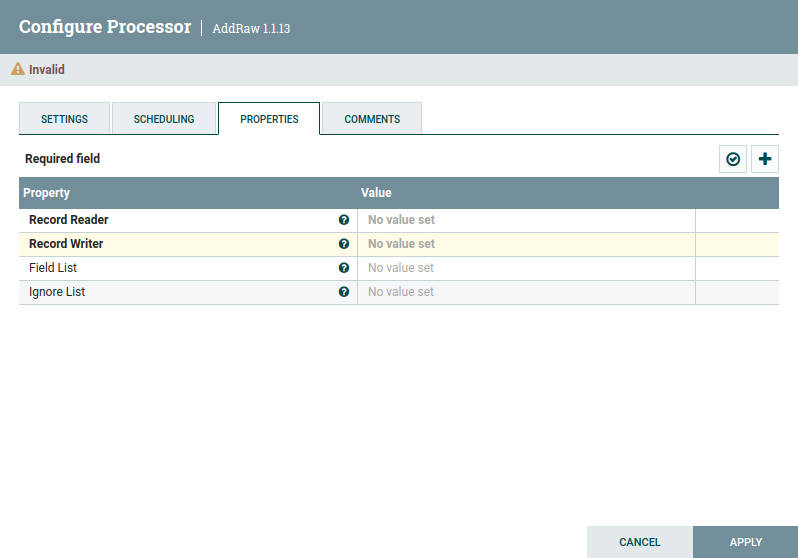
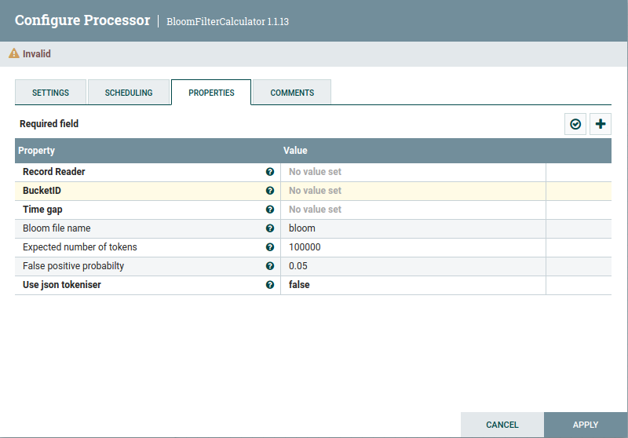
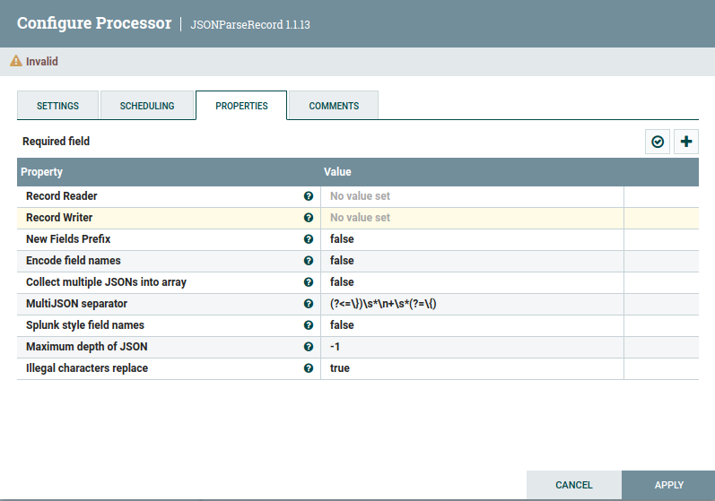
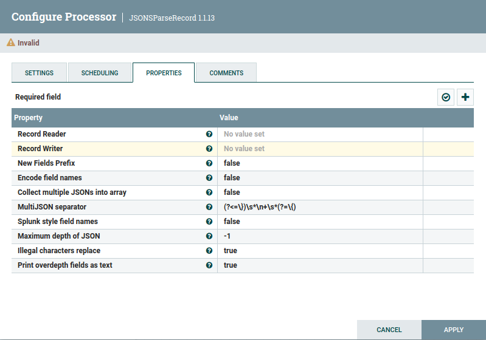
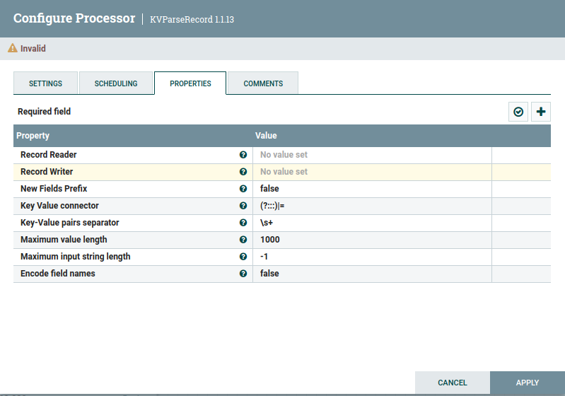

# ISGneuro Ni-Fi custom processors description

This page provides a detailed description of the processors package com.isgneuro.etl.

If the processor does not extend the functionality of one of the standard processors, then the field Extends will be absent. In this case all properties will be described in section Properties. Otherwise, only the added fields will be described.

### AddRaw

Description: Adds _raw field. 

Extends: None

Properties (default values are in parentheses):
1. Record Reader
2. Record Writer
3. Field list
4. Ignore List

### BloomFilterCalculator

Description: Aggregate value of BloomFilter processed in the current session time window.

Extends: None

Properties (default values are in parentheses):
1. Record Reader
2. BucketID
3. Time gap
4. Bloom file name (bloom)
5. Expected number of tokens (100000)
6. False positive probabilty (0.05)
7. Use json tokeniser (false)

### JSONParseRecord

Description: Updates the contents of a FlowFile that contains Record-oriented data (i.e., data that can be read via a RecordReader and written by a RecordWriter). This Processor requires that at least one user-defined Property be added. The name of the Property should indicate a RecordPath that determines the field that should be updated. The value of the Property is either a replacement value (optionally making use of the Expression Language) or is itself a RecordPath that extracts a value from the Record. Whether the Property value is determined to be a RecordPath or a literal value depends on the configuration of the <Replacement Value Strategy> Property.

Extends: None

Properties (default values are in parentheses):
1. Record Reader
2. Record Writer
3. New Fields Prefix (false)
4. Encode field names (false)
5. Collect multiple JSONs into array (false)
6. MultiJSON separator ((?<=\})\s*\n+\s*(?=\{))
7. Splunk style field names (false)
8. Maximum depth of JSON (-1)
9. Illegal characters replace (true)

### JSONSParseRecord

Description: Updates the contents of a FlowFile that contains Record-oriented data (i.e., data that can be read via a RecordReader and written by a RecordWriter). This Processor requires that at least one user-defined Property be added. The name of the Property should indicate a RecordPath that determines the field that should be updated. The value of the Property is either a replacement value (optionally making use of the Expression Language) or is itself a RecordPath that extracts a value from the Record. Whether the Property value is determined to be a RecordPath or a literal value depends on the configuration of the <Replacement Value Strategy> Property.

Extends: None

Properties (default values are in parentheses):
1. Record Reader
2. Record Writer
3. New Fields Prefix (false)
4. Encode field names (false)
5. Collect multiple JSONs into array (false)
6. MultiJSON separator ((?<=\})\s*\n+\s*(?=\{))
7. Splunk style field names (false)
8. Maximum depth of JSON (-1)
9. Illegal characters replace (true)
10. Print overdepth fields as text (true)

### KVParseRecord

Description: Updates the contents of a FlowFile that contains Record-oriented data (i.e., data that can be read via a RecordReader and written by a RecordWriter). This Processor requires that at least one user-defined Property be added. The name of the Property should indicate a RecordPath that determines the field that should be updated. The value of the Property is either a replacement value (optionally making use of the Expression Language) or is itself a RecordPath that extracts a value from the Record. Whether the Property value is determined to be a RecordPath or a literal value depends on the configuration of the <Replacement Value Strategy> Property.

Extends: None

Properties (default values are in parentheses):
1. Record Reader
2. Record Writer
3. New Fields Prefix (false)
4. Key Value connector ((?:::)|=)
5. Key-Value pairs separator (\s+)
6. Maximum value length (1000)
7. Maximum input string length (-1)
8. Encode field names (false)
