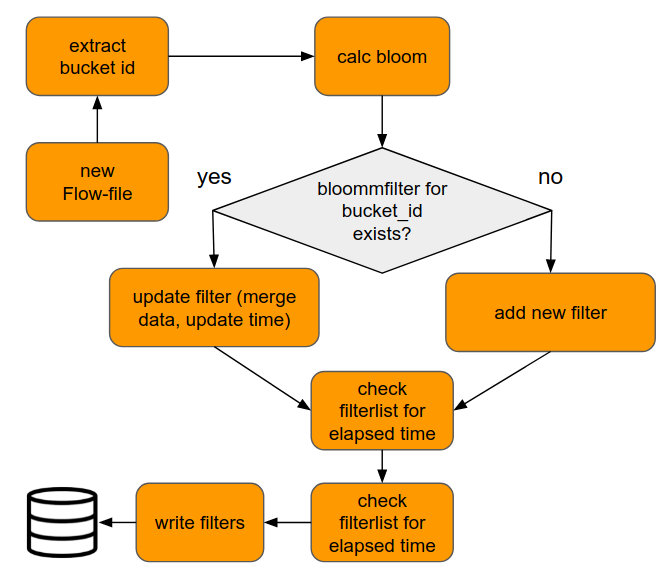
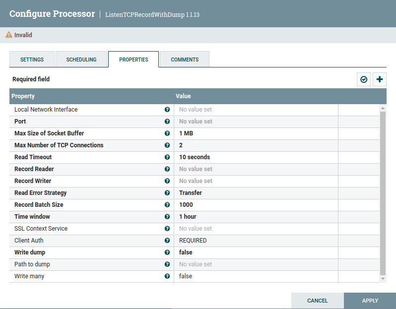
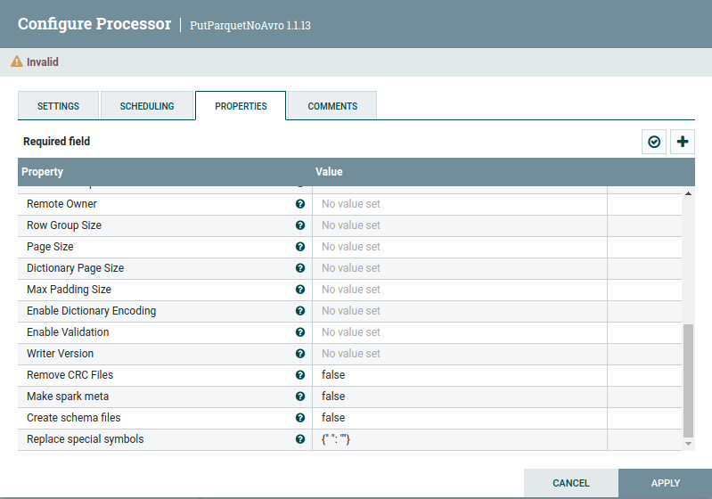
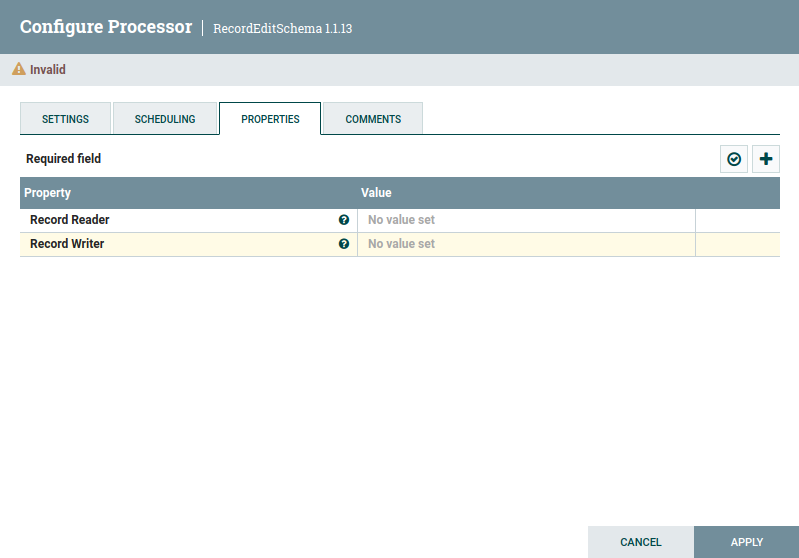

# ISGneuro Ni-Fi custom processors description

This page provides a detailed description of the processors package com.isgneuro.etl.

Some processors are designed from the ground up, some extend the functionality of standard. If the processor does not extend the functionality of one of the standard processors (it extends only abstract processors), then all properties will be described in section Properties. Otherwise, only the added properties will be described.

### AddRaw
<p align="center"><a href="AddRaw.png"></a></p>
 
Description: Adds _raw field. 

Extends: AbstractRecordProcessor

Properties (default values are in parentheses):
1. Record Reader
2. Record Writer
3. Field list (empty). This property contains comma separated list of fields that will be included in the _raw field. 
4. Ignore List (empty). This property contains comma separated list of fields that will be excluded from the _raw field

The processor logic allows the use of only one of the properties 'Field list' and 'Ignore list'

### BloomFilterCalculator
<p align="center"><a href="BloomFilterCalculator.png"></a></p>

Description: Aggregate value of BloomFilter processed in the current session time window.

A Bloom filter is a space-efficient probabilistic data structure (bitmap), conceived by Burton Howard Bloom in 1970, that is used to test whether an element is a member of a set. False positive matches are possible, but false negatives are not – in other words, a query returns either "possibly in set" or "definitely not in set". Detailed description in <a href="https://en.wikipedia.org/wiki/Bloom_filter">this article</a>. 

The Bloom filter can use any amount of memory predefined by the user, and the larger it is, the less likely it is to false positive. Size of bitmap with default propertiesis about 76kB. <a href="https://www.di-mgt.com.au/bloom-calculator.html">Online-calculator for Bloom filter</a>

<p align="center"><a href="Bloom_algorithm.png"></a></p>

Algorithm: When the processor receives a Flow-file, it calculates a bitmap from it and waits specified time for more files with the same bucket (BucketID property). After the time gap has elapsed, the bitmap will be written to disk. The file is written to the bucket directory (BucketID used as path). 
For all files in bucket processor creates one bloom filter file (bitmap file). It is possible because given the existence of two Bloom filters of the same size and with the same set of hash functions, their union and intersection can be implemented using the bitwise disjunction (OR) and conjunction(AND) operations. Therefore, when the processor receives a file from a previously encountered bucket, it merges the filter file with the filter file already written to disk for that bucket. 

Tokens are obtained from the _raw fields of Flow-file data by parsing this field with regular expressions or using json parser.
There are no significant differences between these methods. With parsing _raw with regular expressions you will get additional tokens 

```
metric_long
long
metric
name
```
As you can see, the names of the metric_name and metric_long_name fields are split into separate words, which does not affect the quality of the search.

Extends: AbstractProcessor

Properties (default values are in parentheses):
1. Record Reader
2. BucketID (empty). Usually set as

```
/opt/otp/indexes/${index}/${bucket-${_time_range}
```

where index and _time_range are attributes of Flow-file.
3. Time gap (10 sec).
4. Bloom file name (bloom).
5. Expected number of tokens (100000). Estimated number of distinct tokens in the data. The probability of a false positive is calculated based on the insertion of a given number of elements.
6. False positive probabilty (0.05). The probability of a false positive after insertion N elements, where N is Expected number of tokens.
7. Use json tokenizer (false)

### JSONParseRecord
<p align="center"><a href="JSONParseRecord.png"></a></p>

Description: Updates the contents of a FlowFile that contains Record-oriented data (i.e., data that can be read via a RecordReader and written by a RecordWriter). This Processor requires that at least one user-defined Property be added. The name of the Property should indicate a RecordPath that determines the field that should be updated. The value of the Property is either a replacement value (optionally making use of the Expression Language) or is itself a RecordPath that extracts a value from the Record. Whether the Property value is determined to be a RecordPath or a literal value depends on the configuration of the <Replacement Value Strategy> Property.

Extends: AbstractRecordProcessorWithSchemaUpdates

Properties (default values are in parentheses):
1. Record Reader
2. Record Writer
3. New Fields Prefix (false)
4. Encode field names (false)
5. Collect multiple JSONs into array (false)
6. MultiJSON separator ((?<=\})\s*\n+\s*(?=\{))
7. Splunk style field names (false)
8. Maximum depth of JSON (-1)
9. Illegal characters replace (true)

### JSONSParseRecord
<p align="center"><a href="JSONSParseRecord.png"></a></p>

Description: Updates the contents of a FlowFile that contains Record-oriented data (i.e., data that can be read via a RecordReader and written by a RecordWriter). This Processor requires that at least one user-defined Property be added. The name of the Property should indicate a RecordPath that determines the field that should be updated. The value of the Property is either a replacement value (optionally making use of the Expression Language) or is itself a RecordPath that extracts a value from the Record. Whether the Property value is determined to be a RecordPath or a literal value depends on the configuration of the <Replacement Value Strategy> Property.

Extends: AbstractRecordProcessorWithSchemaUpdates

Properties (default values are in parentheses):
1. Record Reader
2. Record Writer
3. New Fields Prefix (false)
4. Encode field names (false)
5. Collect multiple JSONs into array (false)
6. MultiJSON separator ((?<=\})\s*\n+\s*(?=\{))
7. Splunk style field names (false)
8. Maximum depth of JSON (-1)
9. Illegal characters replace (true)
10. Print overdepth fields as text (true)

### KVParseRecord
<p align="center"><a href="KVParseRecord.png"></a></p>

Description: Updates the contents of a FlowFile that contains Record-oriented data (i.e., data that can be read via a RecordReader and written by a RecordWriter). This Processor requires that at least one user-defined Property be added. The name of the Property should indicate a RecordPath that determines the field that should be updated. The value of the Property is either a replacement value (optionally making use of the Expression Language) or is itself a RecordPath that extracts a value from the Record. Whether the Property value is determined to be a RecordPath or a literal value depends on the configuration of the <Replacement Value Strategy> Property.

Extends: AbstractRecordProcessorWithSchemaUpdates

Properties (default values are in parentheses):
1. Record Reader
2. Record Writer
3. New Fields Prefix (false)
4. Key Value connector ((?:::)|=)
5. Key-Value pairs separator (\s+)
6. Maximum value length (1000)
7. Maximum input string length (-1)
8. Encode field names (false)


### ListenTCPRecordWithDump
<p align="center"><a href="ListenTCPRecordWithDump.png"></a></p>

Description: Listens for incoming TCP connections and reads data from each connection using a configured record reader, and writes the records to a flow file using a configured record writer. The type of record reader selected will determine how clients are expected to send data. For example, when using a Grok reader to read logs, a client can keep an open connection and continuously stream data, but when using an JSON reader, the client cannot send an array of JSON documents and then send another array on the same connection, as the reader would be in a bad state at that point. Records will be read from the connection in blocking mode, and will timeout according to the Read Timeout specified in the processor. If the read times out, or if any other error is encountered when reading, the connection will be closed, and any records read up to that point will be handled according to the configured Read Error Strategy (Discard or Transfer). In cases where clients are keeping a connection open, the concurrent tasks for the processor should be adjusted to match the Max Number of TCP Connections allowed, so that there is a task processing each connection.

Extends: AbstractProcessor. Judging by the source code, it was written based on source of the <a href="https://github.com/apache/nifi/blob/main/nifi-nar-bundles/nifi-standard-bundle/nifi-standard-processors/src/main/java/org/apache/nifi/processors/standard/ListenTCPRecord.java">ListenTCPRecord processor</a>. <a href="https://nifi.apache.org/docs/nifi-docs/components/org.apache.nifi/nifi-standard-nar/1.15.3/org.apache.nifi.processors.standard.ListenTCPRecord/index.html">Description of ListenTCPRecord processor</a>


### MergeRecordNoAvro
<p align="center"><a href="MergeRecordNoAvro.png"></a></p>

Description: None

Extends: MergeRecord

### PutParquetNoAvro
<p align="center"><a href="PutParquetNoAvro.png"></a></p>

Description: Reads records from an incoming FlowFile using the provided Record Reader, and writes those records to a Parquet file. The schema for the Parquet file must be provided in the processor properties. This processor will first write a temporary dot file and upon successfully writing every record to the dot file, it will rename the dot file to it's final name. If the dot file cannot be renamed, the rename operation will be attempted up to 10 times, and if still not successful, the dot file will be deleted and the flow file will be routed to failure. If any error occurs while reading records from the input, or writing records to the output, the entire dot file will be removed and the flow file will be routed to failure or retry, depending on the error.

Extends: AbstractPutHDFSRecord. Judging by the source code, it was written based on the source of the <a href="https://github.com/apache/nifi/blob/main/nifi-nar-bundles/nifi-parquet-bundle/nifi-parquet-processors/src/main/java/org/apache/nifi/processors/parquet/PutParquet.java">PutParquet processor</a>. <a href="https://nifi.apache.org/docs/nifi-docs/components/org.apache.nifi/nifi-parquet-nar/1.15.3/org.apache.nifi.processors.parquet.PutParquet/index.html">Description of PutParquet processor</a>

### RecordEditSchema
<p align="center"><a href="RecordEditSchema.png"></a></p>

Description: Updates the contents of a FlowFile that contains Record-oriented data (i.e., data that can be read via a RecordReader and written by a RecordWriter). This Processor requires that at least one user-defined Property be added. The name of the Property should indicate a RecordPath that determines the field that should be updated. The value of the Property is either a replacement value (optionally making use of the Expression Language) or is itself a RecordPath that extracts a value from the Record. Whether the Property value is determined to be a RecordPath or a literal value depends. User-defined properties values must contain new data type for record field. Use 'drop' or empty string for remove field from record.

Extends: AbstractProcessor

Properties (default values are in parentheses):
1. Record Reader
2. Record Writer

The rest of the properties are user defined. For example, you can add next properties: 
1. /_message with value drop (field will be removed)
2. /time with value LONG (field type will be changed to LONG)